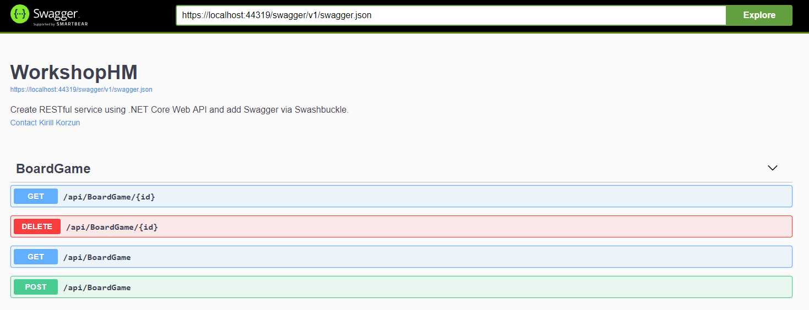

# workshopHW.RESTful

## Task

1. Create REST-service with using .NET Core Web API. One controller is enough, for example, BoardGamesController.

2. Make endpoints GET and POST for getting and adding data - for example, AddBoardGame, GetBoardGameById, GetAllBoardGames, etc.

3. Getting and adding data should execute through DB-service.

4. Service should execute via DI-container.

5. Add data caching. Before getting data from database, check whether the requested object exists in the cache. If so, return it from the cache. If not, from the database and add to the cache.

6. Add caching mechanism through Middleware - you can use "from box" .NET Core response cache.

7. Add Swagger definition via Swashbuckle.

## Short description

1. The project uses HTTPS-protocol, IMemoryCache (middleware), SwaggerUI via Swashbuckle.
    
2. ##### IMPORTANT!!! If you would like to add a new item through POST-request make sure you do not use ID-field. Sample (options):
   
#####  WRONG OPTION

```json
{
  "id": 0,
  "title": "string",
  "description": "string",
  "price": 0
}
```

#####  CORRECT OPTION

```json
{
  "title": "string",
  "description": "string",
  "price": 0
}
```

## Swagger UI


